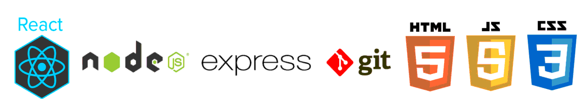

### Hi there 👋

🌍 I’m from **Lyon (FRANCE)**

🌱 I’m currently learning **ReactJs, NodeJS, ExpressJS, Vanilla Js and more..**

🤝 I’m looking for tips on **how to become web developper**

👨‍🦱 💻 All of my projects will be available soon

💬 Let's talk about **web development, JavaScript, design, UI/UX and more...**

📫 How to reach me **pellattiero.julien@gmail.com**

**Hard Skills :**

Projet 1 : Memory Game | JavaScript | Vanilla Html Css
=> https://github.com/Twiggui/Projet-1-Memory-game                    

Projet 2 : Battle Card Heroes | REACT JS, Css, utilisation d'API, méthode Scrum 
=> https://github.com/WildCodeSchool/lyon-js-sept-2020-g5

Projet 3 : Oufgarden |REACT JS, Nodejs ,Css, utilisation d'API, méthode Scrum.  
Front(back coming soon) => https://github.com/WildCodeSchool/lyon-js-sept2020-p3-oufgarden-front-office

